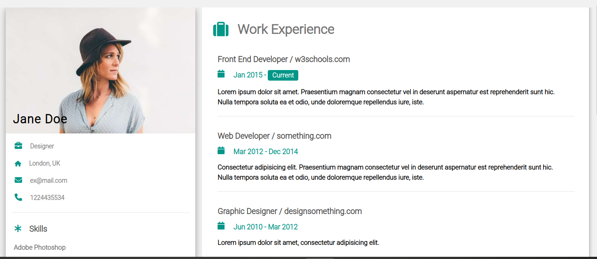

# CV-template project
This is a simple cv template described as follows: the left column which contains the owner's picture, name, address, skills and others. While the other side which is the right column resumes her experience and school career.
## App

### Built with
- HTML
- CSS
### Prerequisistes
knowlegde about:
- HTML
- CSS
- Google chrome
### Clone project
- Get a local copy of the project by following these steps.
- Clone the repository with `git@github.com:Nathanael-Lontsi/cv-template.git` using your terminal.
## Steps
- $ `git@github.com:Nathanael-Lontsi/cv-template.git`
- $ `cd cv-template`
- $ `git checkout feature/container`
## Start App
- run by opening the index.html in the browser
## Author
:bust_in_silhouette: **Nathanael-Lontsi**
-GitHub: [@Nathanael-Lontsi](https://github.com/Nathanael-Lontsi/cv-template)
## :handshake: contributing
Contributions, issues, and feature requests are welcome!
Feel free to check the [issues page](https://github.com/Nathanael-Lontsi/cv-template/issues)
## :memo :license
This project is [w3school](./LICENSE) licensed.